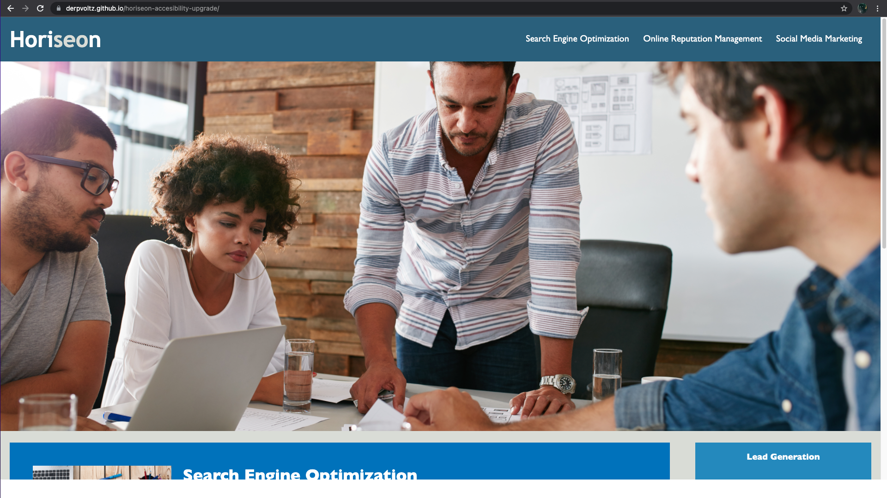

# Challenge 1 - Horiseon

## Description

In this challenge semantic elements were added to make the code more readable. The spacing was also fixed and repeat CSS was removed to improve performance. The title was changed to represent the website, and alt tags were added to make the site more accessible and optimize it for search engines.

## Usage

To open this webpage just use this link [https://derpvoltz.github.io/horiseon-accesibility-upgrade/](https://derpvoltz.github.io/horiseon-accesibility-upgrade/)

## Screenshot

## Credits

RICE-VIRT-BO-FSF-PT-11-2021-U-B

